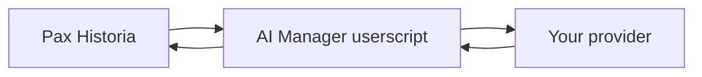
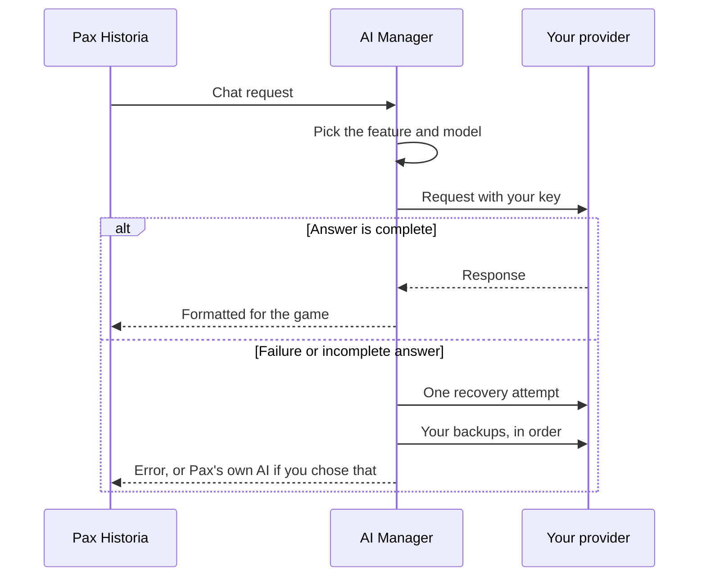
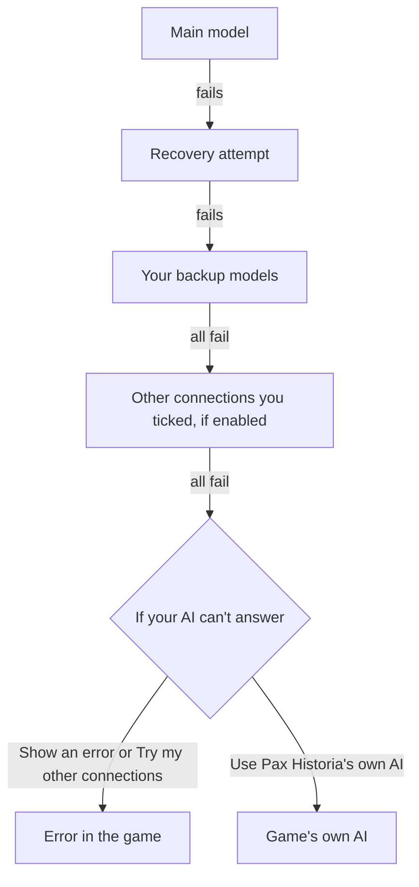

# How it works

[Back to README](../README.md) · [Provider guide](provider-support.md) · [Troubleshooting](troubleshooting.md)

Pax Historia talks to its own AI through one chat address. This script watches that address. When the game sends a request, the script figures out which feature it's for and sends it to the provider and model you picked.

Anything else the game sends goes through untouched. If you haven't set anything up yet and **If your AI can't answer** is set to Pax Historia's own AI, the game's original request goes through too.

## What happens to one request

The script checks every answer before the game sees it. Advisor/actions answers have to match the JSON format the game expects. If one doesn't, that counts as a failure.

## Where your data goes

> [!IMPORTANT]
> Requests go straight from your browser to your provider. No AI Manager server sits in the middle. Your provider gets your prompt and handles it under its own terms and privacy policy.

| What | Where it lives |
| --- | --- |
| Connections, model choices and API keys | Your userscript manager's storage, on this browser |
| Prompts | Sent to the provider you picked for that feature |
| Debug events (off unless you turn them on) | Memory in the open tab. They never include keys or what you wrote. |

The script doesn't write its settings into the game page. If you used an older version of AI Manager, your old settings come across when the script recognizes them.

> [!NOTE]
> Each key is tied to the address you entered it for. If you change a connection's address, the script clears that connection's key and model choices. That way a key can't end up on a server you never picked.

## Backups

The script only runs the backups you added, in the order you put them. Model lists and automatic suggestions never count as backups.

> [!CAUTION]
> **Use Pax Historia's own AI** sends the request to the game and can spend your game credits.

The script retries some short-lived failures and can recover from some half-finished answers. It can't bring back a quota you've used up, and it can't make an unsuitable model work.

## Error codes the game sees

| What went wrong | Status the game gets |
| --- | --- |
| Your provider is rate limiting you | `429` |
| Your provider is down or erroring | `5xx`, as the provider reported it |
| Anything else, including a provider's `401`, `403` or `404` | `502`, with the real reason in the message |

A rejected key shouldn't look like a problem with your game login. That's why those cases show up as `502`.
